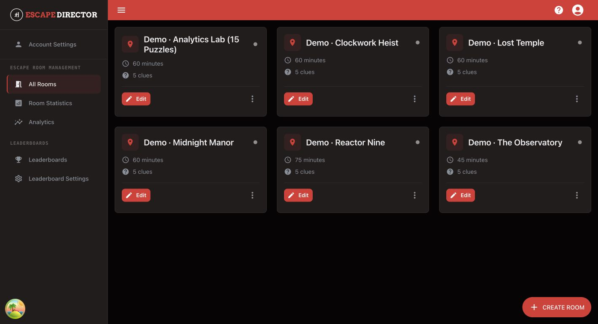

# Welcome to Escape Director

Escape Director brings Room setup, Live View, Game Master controls, Room Sessions, Analytics, and leaderboards into one browser application.

## Choose your path

### I am an owner setting up Escape Director

1. [Create your account and sign in](getting-started/create-your-account-and-sign-in.md).
2. [Activate your plan](getting-started/start-your-trial-and-activate-your-plan.md).
3. [Create your first Room](getting-started/create-and-configure-your-first-room.md).
4. [Build your Room](build-your-rooms/README.md).
5. [Prepare the Room Station](prepare-for-a-shift/prepare-your-room-station.md).

### I am a Game Master preparing for a shift

1. [Prepare the Room Station](prepare-for-a-shift/prepare-your-room-station.md).
2. Keep the [Live Session Quick Reference](run-a-session/live-session-quick-reference.md) nearby.
3. [Run a live Room Session](run-a-session/run-a-live-session.md).
4. [Troubleshoot a live session](run-a-session/troubleshoot-a-live-session.md) if something does not look right.

<figure><figcaption>
All Rooms is the starting point for Room setup and live operation.
</figcaption></figure>

## Browse by task

| I need to... | Start here |
| --- | --- |
| Set up the application | [Get Started](getting-started/README.md) |
| Configure Puzzles, Clues, Live View, or media | [Build Your Rooms](build-your-rooms/README.md) |
| Get a station ready before guests arrive | [Prepare for a Shift](prepare-for-a-shift/README.md) |
| Operate a live game | [Run a Session](run-a-session/README.md) |
| Review results or publish leaderboards | [Review and Improve](review-and-improve/README.md) |
| Fix a problem or contact support | [Troubleshoot and Get Help](help/README.md) |


Escape Director runs in your browser. For live Room operation, use one supported Room Station and test Live View on the actual player-facing display before guests arrive.

