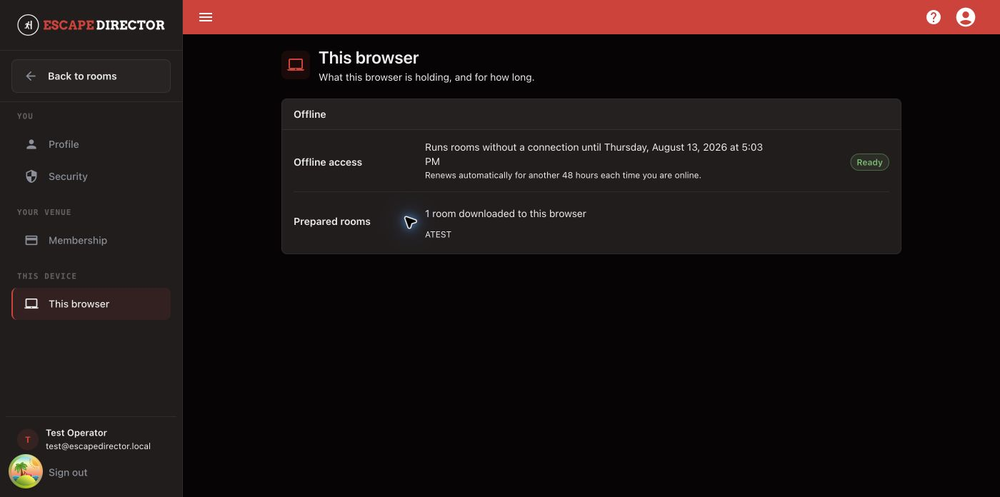

# Use Account Settings

Account Settings is a separate workspace with sections for **Profile**, **Security**, **Membership**, and **This browser**. Use **Back to...** to return to the application page you came from.

## Open Account Settings

Select **Account Settings** in the application navigation or account menu, then choose the section you need.

<figure><figcaption>
This browser reports its own offline access and prepared Rooms; another browser can have different readiness.
</figcaption></figure>

## Update your profile

Open **Profile** to update the account name or phone number. The email address is shown for reference; contact support when it must change. Select **Save** when the unsaved-changes bar appears.

## Review membership and billing

Open **Membership** to check status, plan, and the current period or cancellation date. Select **Manage billing** to open Stripe's billing portal for supported subscription and payment-method actions. Use **Update card** when the status requires payment action.


Review the effective date shown by Stripe before confirming a cancellation or plan change.


## Change your password

Open **Security**. Escape Director shows the sign-in method first. Accounts that sign in only through a linked provider do not have an Escape Director password form.

1. Enter the current password.
2. Enter and confirm the new password.
3. Select **Change password** once.
4. Store the new password securely.

Use **Forgot Password** from the sign-in page when the current password is unavailable.


Changing the password signs out every other browser and tablet immediately, including a Room Station. Change it between games, not during one.


## Check this browser

Open **This browser** to see:

- whether offline access is **Ready** and when it expires;
- how many Rooms are downloaded to this browser; and
- which Rooms are currently prepared.

This state belongs to the current browser profile. It does not prove that another Room Station is ready.

## Sign out

Select **Sign out** only after active Room Sessions and pending saves are complete. Profile, security, and billing changes require a connection; prepared Rooms may still run offline while their displayed access remains valid.

## You're ready when...

The intended profile, membership, security, or browser-readiness state is confirmed and you can return to the application safely.

## Get help

For a membership state that does not match Stripe, or an account you cannot access, [contact support](../help/README.md).
