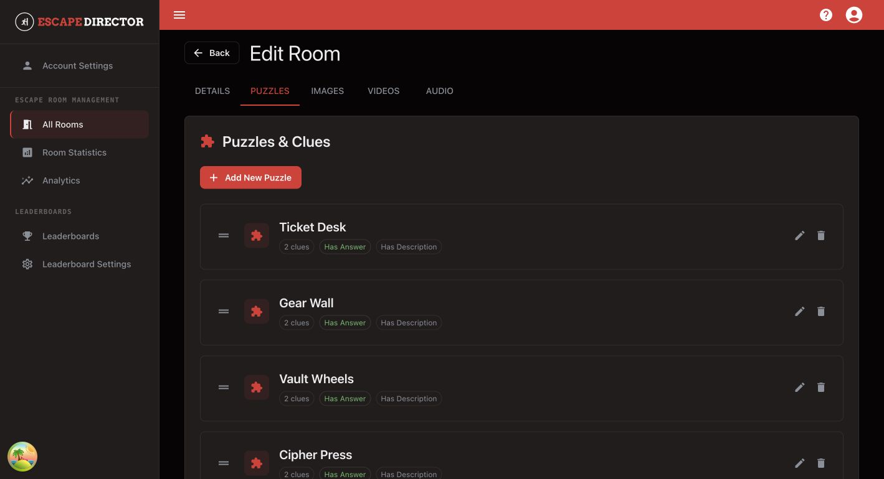

# Add Puzzles and Clues

Use this guide to give Game Masters a clear, ordered Room flow.

## Open the editor

1. Open **All Rooms**.
2. Select **Edit** for the Room.
3. Open the **Puzzles** tab.

<figure><figcaption>
The Puzzle list should match the order staff expects during a live Room Session.
</figcaption></figure>

## Add a Puzzle

1. Select **Add New Puzzle**.
2. Enter a short operational name.
3. Add the answer or solve condition when staff needs it.
4. Add a brief internal description only when it helps the Game Master.
5. Add Clues in escalation order, from a light nudge to direct help.
6. Save the Puzzle.

## Arrange the Room flow

- Reorder Puzzles to match the normal solve sequence.
- Reorder Clues so Game Masters can increase assistance gradually.
- Remove duplicates and old instructions.
- Use player-facing Clue text; keep internal operating notes in the Puzzle description.

## You're ready when...

Every Puzzle has a recognizable name, the intended answer or description, and only the Clues staff may send during a game.

## Next

[Manage Room Media](manage-room-media.md)
