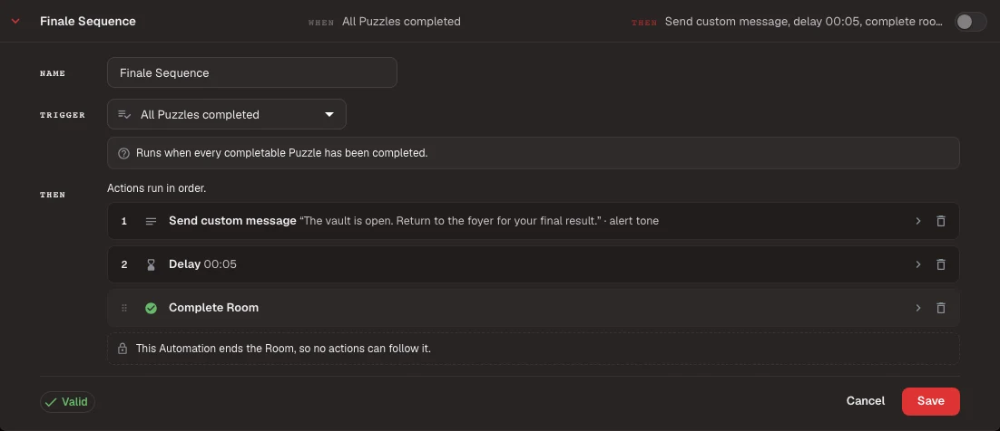

# Configure Room Automations

Use this guide to run an ordered sequence of Room actions from a game event or a Dashboard button.

## Before you begin

- Configure every Puzzle, Clue, media file, and soundtrack the Automation will use.
- Finish or reset any active Room Session.
- Test on the Room Station you will use during live games.

<figure><figcaption>
A valid Automation pairs one Trigger with ordered Actions. This example sends a final message, waits five seconds, then completes the Room.
</figcaption></figure>

## Create an Automation

1. Open **All Rooms** and select **Edit** for the Room.
2. Open the **Automations** tab.
3. Select **New automation** and enter a name that tells the Game Master what the sequence does.
4. Choose the Trigger that starts the sequence.
5. Add each Action in its running order. Drag an Action to change that order.
6. Select **Save** when the editor shows **Valid**.

New Automations start disabled. Escape Director also disables choices that need Room content you have not configured.

## Check the Action order

An Automation can contain up to 20 Actions. Video and audio Actions continue to the next Action immediately unless you enable **Wait until finished before continuing**.

**Complete Room** and **Fail Room** end the sequence. Nothing can follow either Action. Put any end-of-game media before the final Action, or use the Room's configured success and failure screens.

## Enable and test the Automation

1. Turn on the Automation in **Edit Room**.
2. Open the Room Dashboard.
3. Start a controlled test and perform the event that matches the Trigger.
4. For a Dashboard button, open **Automations**, select the named button once, then select it again while **Press again** is shown.
5. Check the timer, Live View, audio, Puzzles, Clues, and Session Log for the expected result.
6. Select **Reset Room** before the next test or live group.


The Room Dashboard does not have a preview or practice mode. Testing an Automation runs its real Actions and can change the timer, send Clues, play media, or complete or fail the Room.


## Prepare for offline operation

Prepare the Room on its Room Station after you finish editing. The prepared Room includes its enabled Automations and referenced media, so they can run during an admitted game without a backend connection.

If you change an Automation or one of its media files, prepare the Room again before relying on it offline.

## You're ready when...

- The Automation is enabled.
- Its Trigger starts it at the intended moment.
- Its Actions run in the intended order.
- The Session Log shows one expandable Automation Run.
- The Room has been reset and prepared on its Room Station.

## Next

[Prepare Your Room Station](../prepare-for-a-shift/prepare-your-room-station.md)
