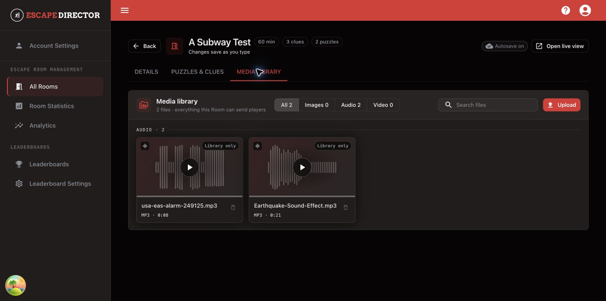

# Manage Room Media

Use this guide to upload, preview, find, and safely remove the media Game Masters and Live View use.

## Upload a Room asset

1. Open **All Rooms** and select **Edit** for the Room.
2. Open **Media library**.
3. Select **Upload**.
4. Choose an image, audio, or video file.
5. Wait for the upload progress to finish.
6. Confirm the new file appears in the matching media group.

<figure><figcaption>
The consolidated Media Library keeps every Room file searchable and previews audio and video before live use.
</figcaption></figure>

## Find and verify a file

- Select **All**, **Images**, **Audio**, or **Video** to narrow the library.
- Use **Search files** when the Room has many assets.
- Play audio or video from its card and use the timeline to check the required moment.
- Read the usage label before removal. A number means the file is referenced by that many Room settings or Clues; **Library only** means it is still available for Game Masters to send even though no saved setting points to it.

## Use media in Live View

Open the **Details** tab to choose Room-level assets such as:

- Alert tone
- Background soundtrack
- Background image or video
- Intro video brief

Use the Puzzle editor when a media asset is a player-facing Clue.

## Replace or delete a file

- Replace a file from the Room setting or Clue that should use the newer asset.
- Delete a file only after reviewing every listed use in the confirmation.
- Use recognizable filenames and avoid near-duplicate uploads.


Deleting a file is permanent. Escape Director also removes it from Room screen settings, and deletes any linked image, audio, or video Clues named in the confirmation. Completed Room Session history remains unchanged.


## You're ready when...

Every required image, video, and audio file is easy to find, appears in the intended Room setting or Clue, and plays on the real Room Station.

## Next

[Prepare for a Shift](../prepare-for-a-shift/README.md)
