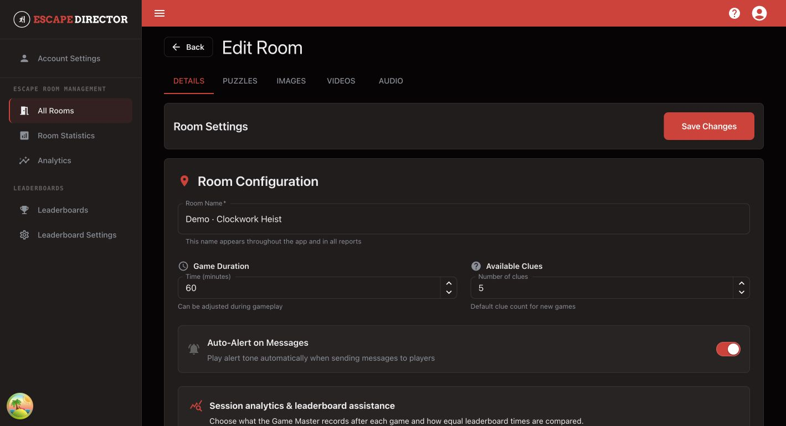

# Create Your First Room

Use this guide to create the Room shell that you will configure and test.

## Create the Room

1. Open **All Rooms**.
2. Select **Create Room**.
3. Enter a Room name your staff will recognize.
4. Set the starting time in minutes.
5. Set the default number of Clues available to players.
6. Save the Room.

<figure><figcaption>
The Details tab contains Room defaults and player-facing screen configuration.
</figcaption></figure>


The Game Master can adjust time and reported Clues during a live Room Session. These values establish the normal starting state.


## Check the Room shell

After saving, confirm that the Room appears on **All Rooms** and that **Edit** opens the Room editor.

## You're ready when...

The correct Room name, starting time, and Clue allowance appear in the editor.


Deleting a Room can remove its associated configuration, media, and history. Edit an incorrect Room instead of deleting it unless you intend to remove it.


## Next

[Build Your Rooms](../build-your-rooms/README.md)
