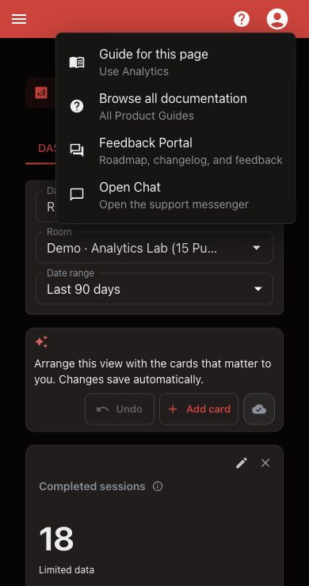

# Troubleshoot and Get Help

## Start with the current task

- Room setup: [Build Your Rooms](../build-your-rooms/README.md)
- Before guests arrive: [Prepare Your Room Station](../prepare-for-a-shift/prepare-your-room-station.md)
- Live game problem: [Troubleshoot a Live Session](../run-a-session/troubleshoot-a-live-session.md)
- Account or billing: [Use Account Settings](../account/use-account-settings.md)

## Open help inside Escape Director

Select **Help** in the application header to open the guide for the current page, browse all documentation, open the Feedback Portal, or start a support conversation.

<figure><figcaption>
Guide for this page changes with the current application workspace.
</figcaption></figure>

## Choose the right support surface

| Need | Use |
| --- | --- |
| Instructions or troubleshooting | Product Guides |
| A feature request, roadmap item, or Product Update | Feedback Portal |
| Direct help with a current problem | **Open Chat** |
| Email support | [support@escapedirector.com](mailto:support@escapedirector.com) |

## Include this with a support request

- Room name
- Page or feature
- What you expected and what happened
- Browser and operating system
- Whether Live View, media, or offline readiness was involved
- A screenshot or screen recording when it does not expose guest or account information

Never send a password, payment information, access token, or customer data in a support request.
