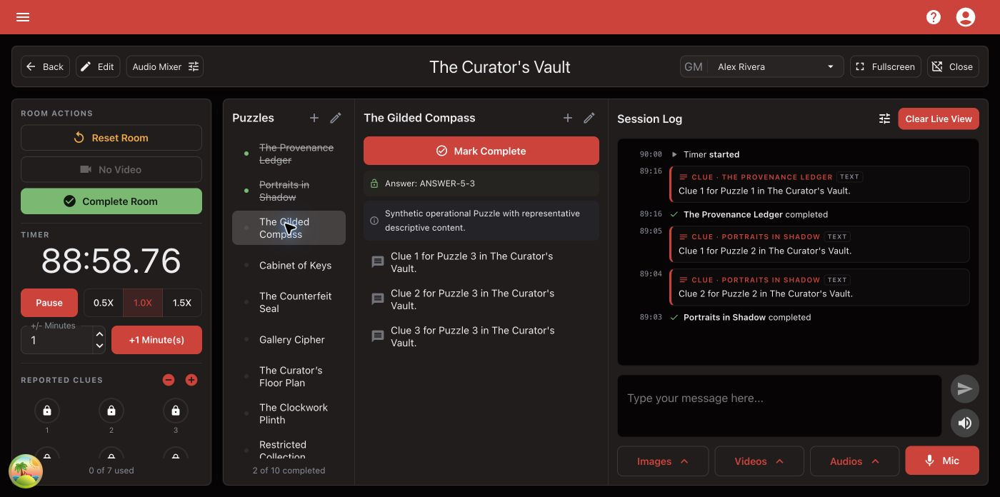

# Prepare Your Room Station

Use this checklist on the computer that will run the Room.

## Before guests arrive

1. Open **All Rooms** and choose the correct Room.
2. Select the Game Master who will run the next group.
3. Select **Open Live View** and place it on the player-facing display.
4. Confirm the Room Dashboard stays available on the Game Master's screen.
5. Check the starting time and reported Clue count.
6. Select a Puzzle and confirm its answer, description, and Clues are present.
7. Open **Audio Mixer** and test required audio at a safe volume.
8. Verify any images or videos needed early in the Room Session.
9. Confirm the **Session Log** starts in the expected state.
10. Select **Reset Room** if the previous test or Room Session changed the state.

<figure><figcaption>
Confirm the complete Game Master workspace before players enter.
</figcaption></figure>

## Check offline readiness when required

When the production application shows an offline readiness status, wait for the current Room to finish preparing before relying on it without a connection. Offline readiness belongs to this browser and its prepared Room revision.

Open **Account Settings → This browser** to confirm when offline access expires and which Rooms are downloaded to this browser.


Normal localhost development does not represent production offline preparation. Qualify offline operation with the production application and supported browser profile.


## You're ready when...

The correct Game Master, timer, reported Clues, Puzzles, media, and Live View are ready on the intended displays.

## Next

[Run a Live Session](../run-a-session/run-a-live-session.md)
