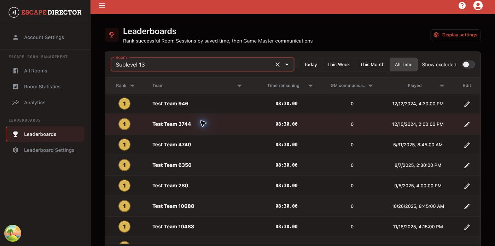
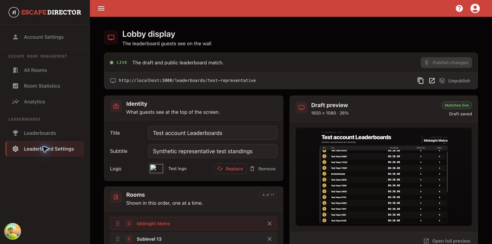

# Manage Leaderboards

Use Leaderboards to review eligible successful Room Sessions and control the player-facing ranking display.

## Review rankings

1. Select **Leaderboards**.
2. Choose a Room.
3. Choose **Today**, **This Week**, **This Month**, or **All Time**.
4. Review team name, saved time remaining, the Room's configured assistance measure, and played date.

<figure><figcaption>
Leaderboards rank included successful Room Sessions within the selected period.
</figcaption></figure>

Saved time remaining determines the primary order. When two eligible Room Sessions have equal time, the Room's configured assistance measure supplies the supported tie-break. Failed Room Sessions are not ranked.

## Correct a leaderboard entry

Use the row edit action to correct the public team name or select **Exclude from public leaderboards**. Keep private operational notes in Room Statistics; do not put them in the public team name.

Use **Show excluded** only when you need to review entries intentionally removed from the public ranking.

## Configure the lobby display

Select **Display settings** to open the lobby display workspace.

<figure><figcaption>
The draft preview stays beside the settings while the public leaderboard remains on the last published version.
</figcaption></figure>

Work through the page in order:

1. Set the display title, optional subtitle, and logo under **Identity**.
2. Add Rooms, drag them into presentation order, and select a Room to preview it.
3. Under **Standings**, choose how many teams to show and the ranking period. Rank, team, time, and Clues are automatic; select the optional **Players** and **Date** columns in the table preview.
4. Under **Appearance**, choose the default background, any Room-specific background exceptions, and the fallback color used when there is no image.
5. Check the **Draft preview** at the right. Open the full preview when you need to judge it at display size.

Changes save to a draft automatically; they do not change the public leaderboard until you select **Publish** or **Publish changes**. Use **Reset to published** to discard the current draft and restore the live configuration. After publishing, use **View live** to check the public link on the actual lobby display.

## You're ready when...

The correct Room and period show only the successful Room Sessions intended for public ranking, and the lobby display reports that the draft and public leaderboard match.
