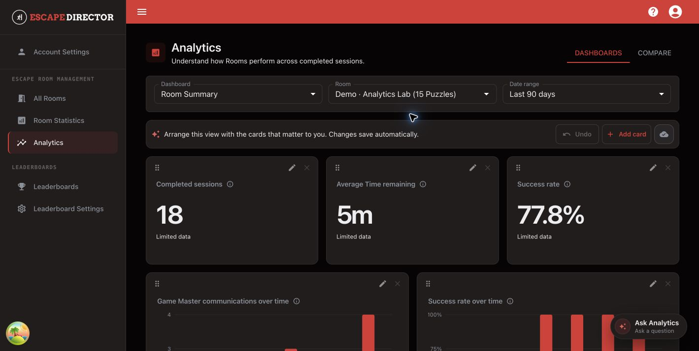

# Use Analytics

Use Analytics to find patterns across completed, non-excluded Room Sessions.

## Open a dashboard

1. Select **Analytics**.
2. Choose a dashboard.
3. Choose the Room and date range.
4. Read each card's value, sample note, coverage, and calculation details together.

<figure><figcaption>
Dashboard cards use the selected Room and date range.
</figcaption></figure>

`Limited data` means the result is available but should be read with its sample or coverage limitations. It does not mean that zero was observed.

## Arrange the dashboard

- Select **Add card** to choose a supported metric and presentation.
- Use a card's edit action to change supported options.
- Move or resize cards to emphasize the questions your team reviews most often.
- Wait for **Saved** after a layout change.

Analytics accepts supported Metric Definitions and parameters; it does not accept arbitrary formulas or SQL.

## Compare performance

Open **Compare** when you need an explicit Room or Game Master comparison. Keep the sample size and data coverage beside the observed values, and do not treat a difference as proof that one person or Room caused it.

## Ask Analytics

Select **Ask Analytics** for a read-only answer based on governed Analytics evidence. Review the selected Room, date range, evidence, and limitations before acting on the result. A proposed dashboard card is not saved until you explicitly apply it.

## You're ready when...

You can state what the selected metric shows, which Room Sessions it covers, and what limitation would change the conclusion.

## Next

[Manage Leaderboards](manage-leaderboards.md)
