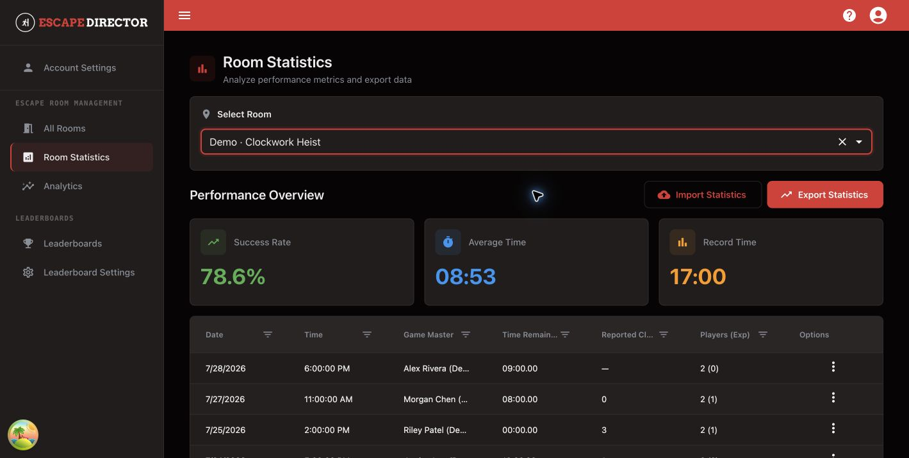

# View Room Statistics

Use Room Statistics when you need the details of individual Room Sessions.

## Open a Room

1. Select **Room Statistics** in the application navigation.
2. Choose a Room.

<figure><figcaption>
Room Statistics combines summary values with the underlying Session list.
</figcaption></figure>

## Read the overview

The overview shows the Room's current success rate, average saved time remaining, and record saved time based on the available Room Sessions.

Use the table to review:

- Date and time
- Game Master
- Saved time remaining
- Reported assistance measure
- Total and experienced players

## Open a Room Session

Use the row action to edit permitted Session details, view notes, or view the Action Feed history. Historical records may preserve an earlier Game Master display-name snapshot even after the active profile is renamed or archived.


Delete a Room Session only when it should no longer exist. Use an Analytics exclusion when the record should remain in history but must not affect governed metrics.


## Import or export CSV

- **Export Statistics** downloads the selected Room's supported CSV format.
- **Import Statistics** validates the selected file before adding compatible records.

Do not edit column names or mix customer data from different Rooms without a clear operating reason and a retained backup.

## You're ready when...

The expected Room Session appears with the correct Game Master, saved time, assistance measure, and player details.

## Next

[Use Analytics](use-analytics.md)
