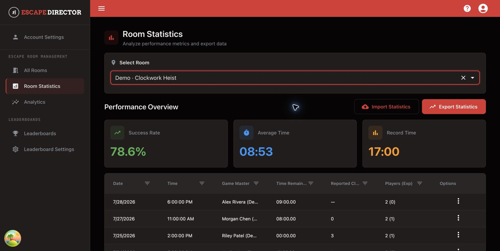

# View Room Statistics

Use Room Statistics when you need the details of individual Room Sessions.

## Open a Room

1. Select **Room Statistics** in the application navigation.
2. Choose a Room.

<figure><figcaption><p>Room Statistics combines summary values with the underlying Session list.</p></figcaption></figure>

## Read the overview

The overview shows the Room's current success rate, average saved time remaining, and record saved time based on the available Room Sessions.

Use the table to review:

- Date and time
- Game Master
- Saved time remaining
- Reported Clues when the Room collects them
- Total and experienced players

## Open a Room Session

Use the row action to edit the team name, Game Master, reported Clues when applicable, player counts, notes, or public-leaderboard exclusion. Date, result, Room, and time remaining cannot be changed.

Open **Session Log** to review the saved event history. Review mode shows **Sent to players**, **Completions**, and **Clock changes** by default, while session start, time adjustments, and the outcome are always shown. Historical records may preserve an earlier Game Master display-name snapshot even after the active profile is renamed or archived.


Delete a Room Session only when it should no longer exist. Use **Exclude from public leaderboards** when the record should remain available for operational review but must not appear in public rankings.


## Import or export CSV

- **Export Statistics** downloads the selected Room's Room Sessions as a CSV file.
- **Import Statistics** checks the chosen file before adding its Room Sessions to the selected Room. If anything in the file needs fixing, nothing is imported and Escape Director tells you which row and column to correct.

Before importing, create a Game Master Profile for every Game Master named in the file. Names match regardless of capitalization.

Do not mix Room Sessions from different Rooms in one file, and keep a copy of the original before you edit it.

## Statistics CSV format

Start from an export or from the [template CSV](../.gitbook/assets/room-statistics-template.csv). The first row must contain these headers, spelled exactly and in this order. Each following row is one Room Session.

| Column | Required | Allowed values |
| --- | --- | --- |
| Played At | Yes | The session's date and time, like `2026-07-19T18:00:00.000Z`. |
| Result | Yes | `Success` or `Failure`. |
| Time Remaining | Yes | Minutes, seconds and hundredths as `mm:ss.cc`, like `12:34.56`. Use `00:00.00` when no time remained. |
| Game Master | Yes | The name of one of your Game Master Profiles. |
| Team Name | No | Any text. |
| Clues Used | No | A whole number, like `2`. Leave it blank when the number is unknown. |
| Total Players | Yes | A whole number, like `5`. |
| Experienced Players | No | A whole number, like `3`. A blank value counts as `0`. |
| Notes | No | Any text. Put the value in double quotes if it contains a comma or a line break. |
| Leaderboard Excluded | No | `true` to keep the session off public leaderboards. A blank value or `false` includes it. |

Example row:

```
2026-07-19T18:00:00.000Z,Success,12:34.56,Jordan Reyes,The Gear Grinders,2,5,3,Strong start in the vault,false
```

Write dates with the time zone, as exports do, so sessions keep the right day and time. A date without a time zone is read in your computer's time zone.

### Older exports

Files exported before the current format have six columns: Date, Game Master, Time Remaining, Clues Used, Total Players and Experienced Players. Import Statistics still accepts them. Each session is recorded as a failure when Time Remaining is `00:00.00`, and as a success otherwise.

## You're ready when...

The expected Room Session appears with the correct Game Master, saved time, reported Clues when collected, and player details.

## Next

[Use Analytics](use-analytics.md)
