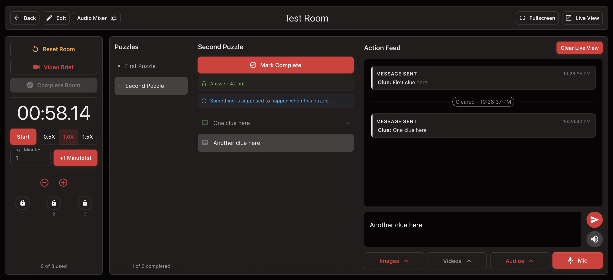

# Run A Live Session

<figure><figcaption>
Example Dashboard
</figcaption></figure>

The Room Dashboard is the control center for live gameplay. This is where game masters manage the timer, communicate with players, track clue use, and save the session when the game ends.

## Open The Room Dashboard

1. Go to `All Rooms`.
2. Select the room you want to run.

From the dashboard header, you can:

* Go back to the previous page
* Open the room editor
* Open the audio mixer
* Open or close Live View
* View offline readiness for room media
* Toggle dashboard fullscreen


Make sure the correct room is open and Live View is ready before players enter the room.


## Prepare The Room Before Starting

Before a new group begins:

1. Reset the room if needed.
2. Open Live View.
3. Confirm the background, timer, message area, and clue counter all look correct.

If the real display does not match the editor preview, adjust the Live View settings before continuing.

## Start And Control The Timer

Use the timer controls to:

* Start the session
* Pause the timer if needed
* Change timer speed between `0.5x`, `1.0x`, and `1.5x`
* Add or subtract time manually

Manual time changes are useful when:

* You need to grant extra time
* A group starts late
* The room needs a correction during the session


Manual time changes are logged with the real time when the action happened.


## Track Clue Usage

Use the clue controls to:

* Mark clues as used
* Add or remove clue slots if the session policy changes

## Send Messages And Media To Players

Use the message area to communicate with players during the session.

You can:

* Send live text messages
* Trigger an alert tone
* Send uploaded images, videos, or audio
* Clear the Live View
* Use the microphone for direct audio transmission

## Use The Puzzle List During Gameplay

Select a puzzle from the list to view:

* The puzzle name
* Answer or solve condition
* Internal details
* Available clues

This helps staff stay consistent and choose the right clue at the right time.

## End The Session

When the game is finished:

1. Complete the room if the players succeeded.
2. Let the timer expire or fail the room if they did not.
3. Fill out the statistics modal.

### Session Details

Expected fields include:

* Game master
* Clues used
* Total players

You can also save:

* Experienced players
* Notes about the run


If you close the session without saving the statistics, you may lose run data and action-log history for that session.


## What To Do Next

After the session is saved, review the room's performance:

* [View Room Statistics](../../review-performance/review-performance/view-room-statistics.md)

## Troubleshooting

### The Live View opened, but it does not look right

Check the room's Live View settings, background media, timer visibility, message placement, and clue counter visibility.

### I cannot send image, video, or audio from the dashboard

This usually means no media of that type has been uploaded to the room yet.

### The timer needs correction during the game

Use the manual minute adjustment, then record the reason in the session notes when saving statistics.

### Should every session be saved at the end?

If you want reliable room statistics and notes later, each real session should be saved properly.
